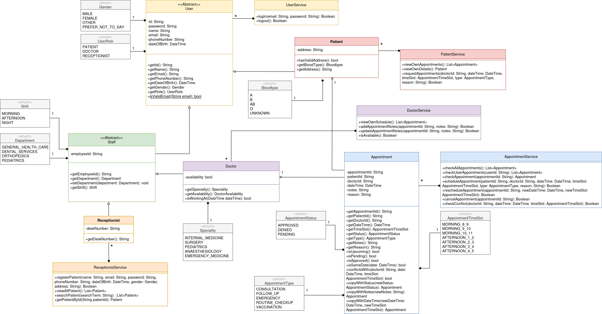

# Hospital Appointment Management System

A console-based hospital appointment management system built with Dart. This application allows patients to request appointments, doctors to manage their schedules and availability, and receptionists to coordinate and approve appointments.

## Features
- **Patient Portal**: Request appointments, view upcoming appointments, and check appointment details
- **Doctor Portal**: Manage schedules, view appointments, add notes, and toggle availability
- **Receptionist Portal**: Register patients, view and filter appointments, approve/deny requests
- **Authentication**: Secure login system with role-based access control
- **Persistent Storage**: JSON-based data persistence for users, appointments, and medical records

## Use Case

## UML Diagram

